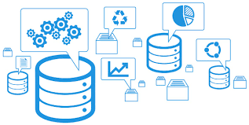

# Administración de Base de Datos Relacionales y NOSQL

En este repositorio se encuentran script relacionados a la administración de base de datos relacionales y no relacionales, con temas relacionados:

1. Creación de Base de Datos
2. Seguridad
3. Respaldos y restauraciones
4. Servidores Vinculados 
5. Monitoreo
6. Automatización de tareas

